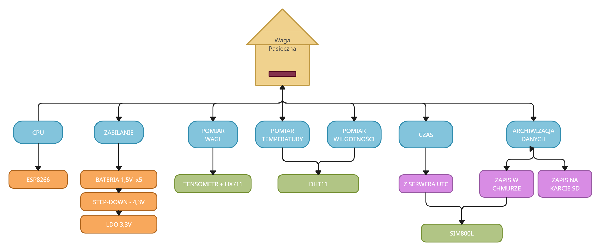

## Waga_Pasieczna
Projekt wagi pasiecznej, która zbiera informacje o wadze, temperaturze i wilgotności powietrza [W trakcie prac]

Platforma ESP32 / ESP8266

Język: MicroPython

Przygotowane biblioteki do obsługi:
- czytnika kart pamięci
- czujnika temperatury i wilgotności powietrza dht11
- modułu pomiarowego dla belki tensometrycznej hx711
- modułu GSM sim800l

